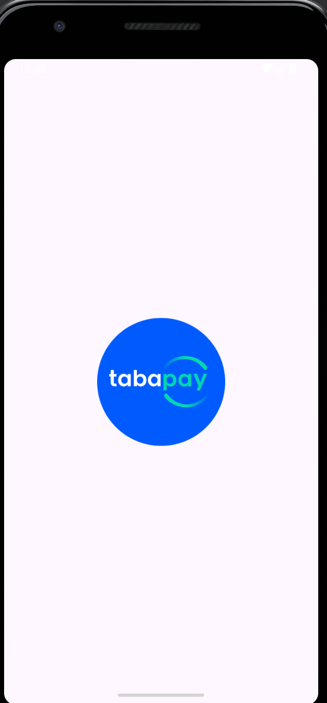

# Payment Processing SDK and Sample App

## Introduction

The Payment Processing SDK simplifies the integration of payment transactions into Android applications. This repository includes the SDK and a sample app that demonstrates its capabilities using mock data for simulating payment transactions.


## Features

- **Transaction Processing**: Simulate payment transactions with success, failure, and processing states.
- **Payment Methods Management**: Add, remove, and list payment methods (credit and debit cards) using mock data.
- **Transaction History**: Retrieve a user's transaction history.
- **Mock Payment Provider Integration**: Simulate real payment gateway responses.


##Screenshots



## Getting Started
### Prerequisites
- Android Studio 2020.3.1 (Arctic Fox) or newer.
- Kotlin plugin installed.
- Min Android SDK version 24.

## Installation
 **1.Clone this repository:**

```
git clone https://github.com/yourgithub/payment-processing-sdk.git

 ```
**2.Open the project in Android Studio.**

**3.Sync Gradle and build the project.**

## Using the SDK
Initialize the SDK in your application's onCreate method or before performing any payment operations:

```
MockPaymentService.init(context)

 ```
Process Payments, manage payment methods, and retrieve transaction history using the SDK's APIs as documented in the detailed Documentation section.

# Sample App
The included sample app demonstrates the use of the Payment Processing SDK for simulating payment transactions. Explore the app to understand how to integrate and utilize the SDK in a real-world scenario.

### Running the Sample App
Open the project in Android Studio.

Select a device or emulator.

Run the application.

# Documentation
Refer to the Documentation for detailed information on integrating the SDK into your projects, including setup instructions, API usage, and handling responses from the mock payment provider.

# Support
If you encounter any issues or have questions, please contact sidmundece17@gmail.com.

# Contributing
Contributions are welcome! Please read our Contributing Guide for more information on making pull requests.

# License
This project is licensed under the MIT License - see the LICENSE file for details.
